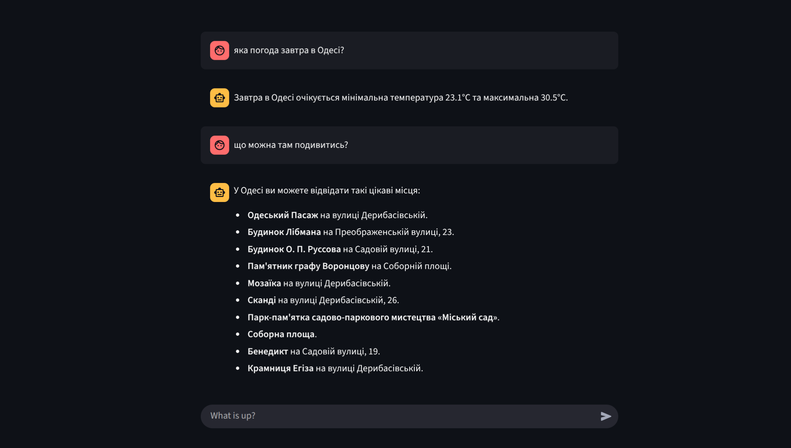
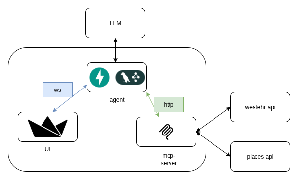

# Weather and places assistant



## app consist of modules
* agent
* mcp-server
* ui



### agent
Simple app with fastapi and lnggraph to receive messages va websockets and using llm and mcp server produce response

### mcp-server
Mcp server that provides weather and places tools

### ui
Streamlit app that sends user messages via websocket and displaces agent responses

## usage

run ```docker-compose up```

